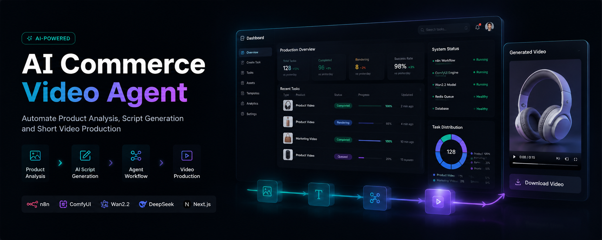

# 🚀 AI Commerce Video Agent

  

  <b>AI-powered Product Video Generation & E-commerce Automation Platform</b>

  基于 AI Agent 的跨境电商智能内容生产与自动化平台

---

# 🌟 Overview | 项目简介

## 中文介绍

AI Commerce Video Agent 是一个面向全球电商场景设计的 AI 内容生产自动化系统。

通过结合：

- AI Agent
- 大语言模型
- 多模态模型
- 图像生成模型
- 视频生成模型
- 自动化工作流

将商品图片、产品信息快速转化为：

- 商品营销视频
- 短视频脚本
- 场景化素材
- 多语言广告内容

帮助跨境电商卖家实现：

**商品 → 内容 → 视频 → 全球营销**

的一站式智能生产。

---

## English Introduction

AI Commerce Video Agent is an AI-powered automation platform designed for global e-commerce content creation.

By combining:

- AI Agents
- Large Language Models
- Multimodal AI
- Image Generation
- Video Generation
- Workflow Automation

The system converts product information into:

- Marketing videos
- Product scripts
- Visual assets
- Multilingual advertising content

Building an intelligent pipeline:

**Product → Content → Video → Global Commerce**

---

# 🏗 System Architecture | 系统架构

## Architecture Flow

            User Input

                │

                ▼

         Task Management

                │

                ▼

          AI Agent Layer

                │

┌──────────────────┼──────────────────┐

▼ ▼ ▼

Product Script Agent Scene Agent

Analysis Generation Planning

                │

                ▼

      Image / Video Generation

                │

                ▼

         Asset Management

                │

                ▼

      Final Marketing Content

---

# ✨ Core Features | 核心功能

## 🎬 AI Video Generation

### AI 视频生产系统

支持：

- 商品图片理解
- 产品卖点分析
- 视频脚本生成
- 场景规划
- AI 视频生成

实现自动化商品视频生产。

---

## 🧠 Agent Workflow

系统通过多个 AI Agent 协同工作：

Product Agent

  ↓

Marketing Agent

  ↓

Script Agent

  ↓

Scene Agent

  ↓

Video Agent

  ↓

Asset Agent

实现从商品输入到视频输出的自动化流程。

---

## 📦 Asset Management

### 素材管理系统

支持：

- 图片素材管理
- 视频素材管理
- 历史任务管理
- 自动归档

---

## 🎭 Template System

提供：

- Script Template
- Scene Template
- Model Template

帮助快速生成不同类型电商内容。

---

# 🖥 Product Preview | 产品展示

## Dashboard

AI生产任务总览中心：

- 视频任务状态
- 生成队列
- 数据统计
- 任务管理

---

## Task Center

统一管理：

- 视频生成任务
- 内容生成任务
- 自动化流程状态

---

## Asset Library

集中管理：

- 产品图片
- 视频素材
- AI生成结果

---

## Scene Template

AI 场景模板：

- Home Scene
- Beauty Scene
- Lifestyle Scene
- Commercial Scene

---

## Model Template

支持不同：

- 人物模型
- 国家地区
- 风格模板

---

## Script Template

营销脚本自动生成：

- 产品卖点
- 视频结构
- 镜头设计
- 广告语言

---

## System Management

系统服务管理：

- Database
- Queue
- AI Service
- Automation Workflow

---

# 🛠 Technology Stack | 技术架构

## Frontend

- React
- TypeScript
- TailwindCSS

## Backend

- Python
- FastAPI
- MySQL
- Redis

## Workflow Automation

- n8n
- AI Workflow Engine

## AI Infrastructure

- LLM
- Multimodal Models
- Image Generation Models
- Video Generation Models

---

# 🔄 Workflow | 工作流程

Product Image

    ↓

AI Product Understanding

    ↓

Marketing Strategy

    ↓

Script Generation

    ↓

Scene Planning

    ↓

AI Video Generation

    ↓

Marketing Asset Output

---

# 🌍 Application Scenarios | 应用场景

## Cross-border E-commerce

跨境电商：

- TikTok Shop
- Shopee
- Lazada
- Amazon

## Marketing Content

营销内容：

- Product Video
- Advertisement
- Social Media Content

## Enterprise Automation

企业自动化：

- Content Factory
- AI Marketing Team
- Intelligent Workflow

---

# 🚧 Roadmap

## Phase 1

✅ AI video workflow

✅ Template system

✅ Asset management

---

## Phase 2

⬜ Multi-agent collaboration

⬜ Automatic product analysis

⬜ Multi-language marketing

---

## Phase 3

⬜ Enterprise deployment

⬜ AI commerce ecosystem

⬜ Full automation platform

---

# 📌 Vision

Building the next generation AI-powered commerce infrastructure.

构建下一代 AI 驱动的全球电商内容基础设施。

---

# 📮 Contact

AI Commerce Video Agent

AI + Commerce + Automation
