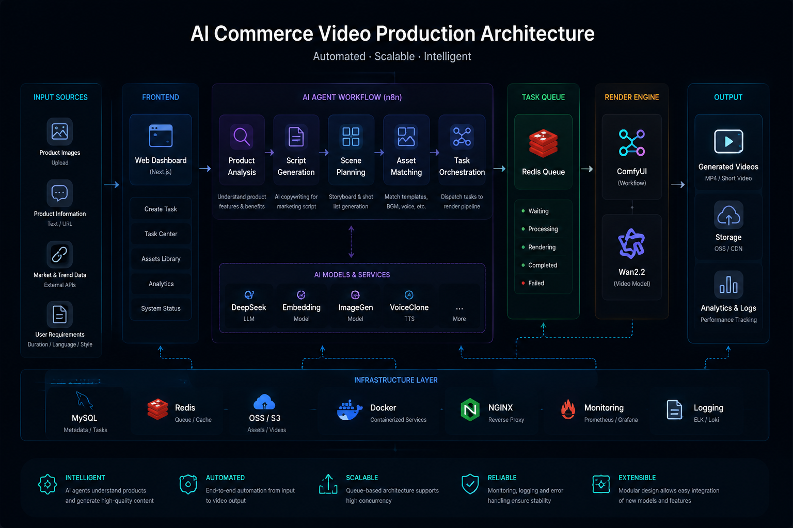
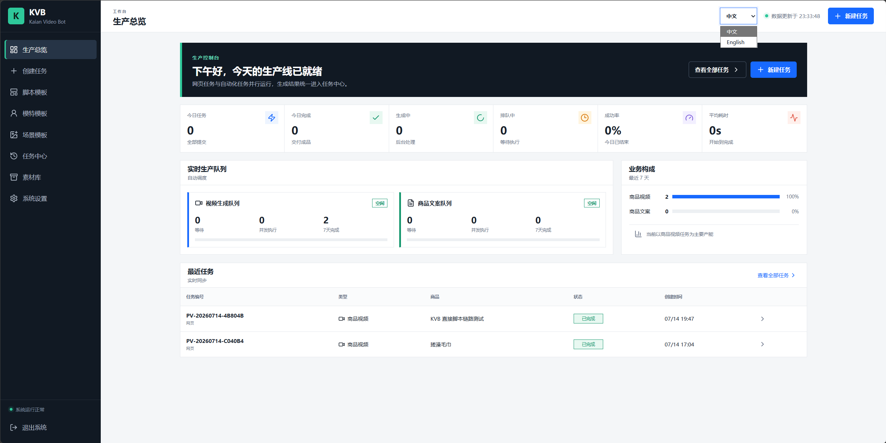
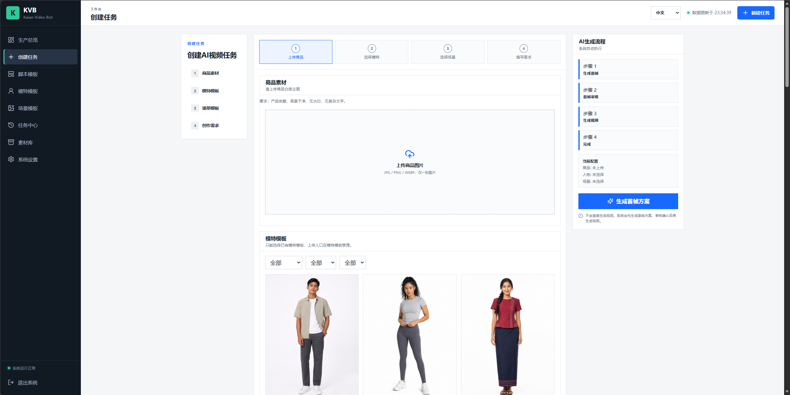
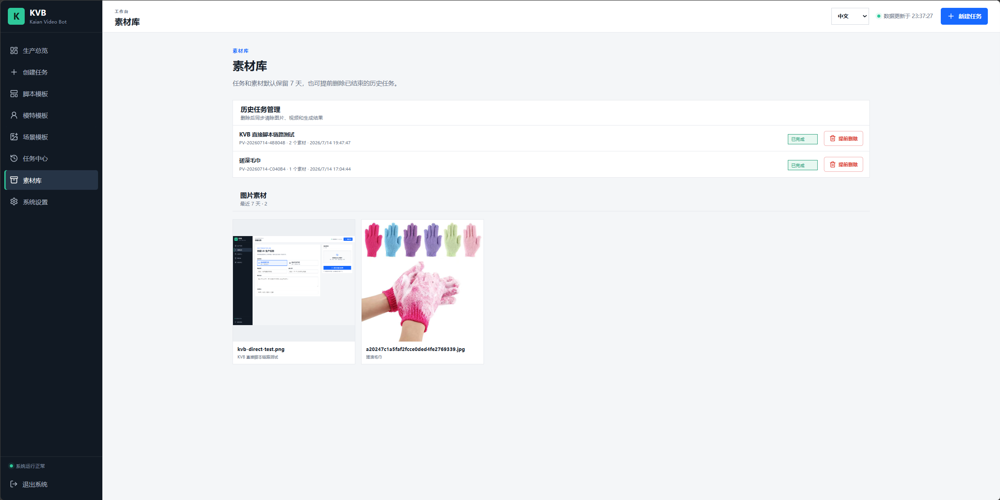
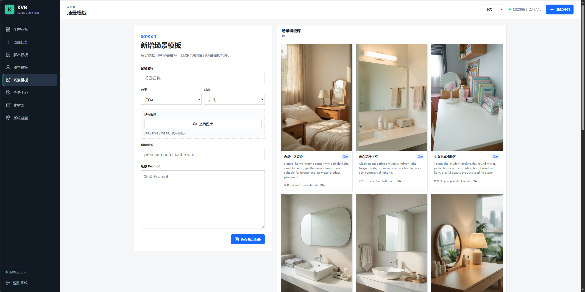
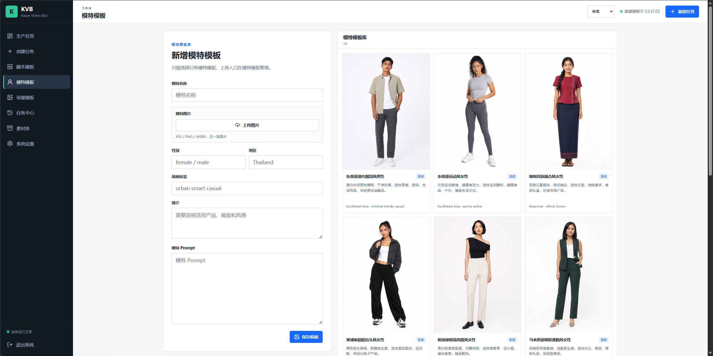
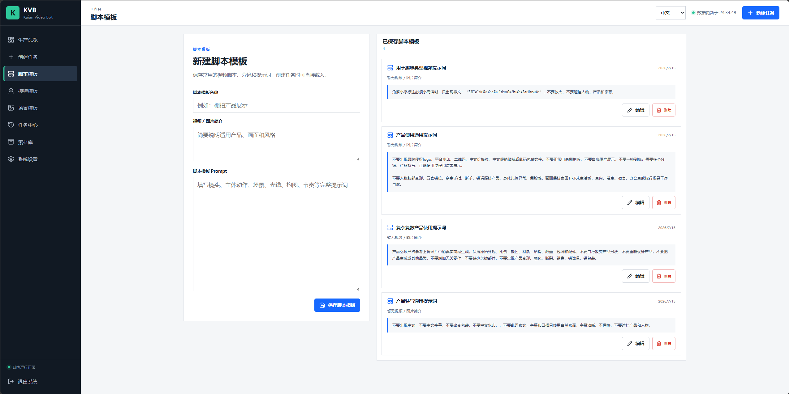
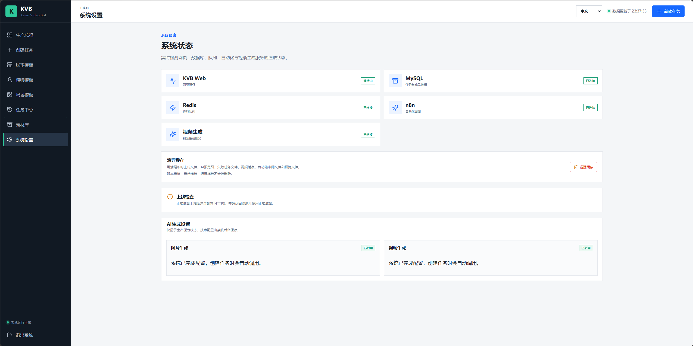

# 🚀 AI Commerce Video Agent

  

  <b>
  AI-powered Product Video Generation & E-commerce Automation Platform
  </b>

  基于 AI Agent 的跨境电商智能内容生产与自动化平台

---

# 🌟 Overview | 项目简介

AI Commerce Video Agent is an AI-powered automation platform designed for global e-commerce content creation.

AI Commerce Video Agent 是一个面向全球电商场景设计的 AI 内容生产自动化平台。

The platform combines AI Agents, Large Language Models, Multimodal AI, Image Generation, Video Generation and Workflow Automation.

系统融合 AI Agent、大语言模型、多模态模型、图像生成模型、视频生成模型以及自动化工作流。

It transforms product information into high-quality marketing content automatically.

将商品信息自动转化为高质量营销内容。

Including:

包括：

- Product Marketing Videos  
  商品营销视频

- AI Generated Scripts  
  AI生成营销脚本

- Scene-based Visual Assets  
  场景化视觉素材

- Multilingual Advertising Content  
  多语言广告内容

Building an intelligent pipeline:

构建智能生产链路：

Product
商品

↓

Content
内容

↓

Video
视频

↓

Global Commerce
全球营销

---

# 🏗 System Architecture | 系统架构

## Architecture Flow | 架构流程

User Input
用户输入

    │

    ▼

Task Management
任务管理系统

    │

    ▼

AI Agent Layer
AI Agent 智能层

    │

┌──────┼────────┐

▼ ▼ ▼

Product Agent Script Agent Scene Agent

商品分析Agent 脚本生成Agent 场景规划Agent

    │

    ▼

Image / Video Generation

图片与视频生成

    │

    ▼

Asset Management

素材管理

    │

    ▼

Marketing Content Output

营销内容输出

---

# ✨ Core Features | 核心功能

## 🎬 AI Video Generation | AI视频生成系统

Automatically generate product videos through AI.

通过 AI 自动生成商品营销视频。

Features:

功能：

- Product Image Understanding  
  商品图片理解

- Product Feature Extraction  
  产品卖点分析

- Script Generation  
  视频脚本生成

- Scene Planning  
  场景规划

- AI Video Generation  
  AI视频生成

---

# 🧠 Multi-Agent Workflow | 多智能体工作流

Multiple AI Agents cooperate to complete the entire content production process.

多个 AI Agent 协同完成完整内容生产流程。

Product Agent

商品分析Agent

    ↓

Marketing Agent

营销策略Agent

    ↓

Script Agent

脚本生成Agent

    ↓

Scene Agent

场景规划Agent

    ↓

Video Agent

视频生成Agent

    ↓

Asset Agent

素材管理Agent

From product input to final marketing content.

实现从商品输入到营销内容输出的自动化流程。

---

# 📦 Asset Management | 素材管理系统

Centralized management of AI generated assets.

集中管理 AI 生成素材。

Supports:

支持：

- Product Images
  商品图片

- Generated Videos
  AI视频

- Historical Tasks
  历史任务

- Production Records
  生产记录

---

# 🎭 Template System | 模板系统

Reusable AI content templates.

可复用 AI 内容模板。

Including:

包括：

- Script Template  
  脚本模板

- Scene Template  
  场景模板

- Model Template  
  模特模板

Help merchants quickly create different styles of marketing content.

帮助商家快速生成不同类型营销内容。

---

# 🖥 Product Preview | 产品展示

## Dashboard | 智能生产控制台

AI production command center.

AI 内容生产控制中心。

Includes:

包含：

- Task Monitoring  
  任务监控

- Generation Queue  
  生成队列

- Production Statistics  
  生产数据

- Workflow Management  
  工作流管理

---

## Task Center | 任务中心

Unified management of AI production tasks.

统一管理 AI 生产任务。

Supports:

支持：

- Video Generation Tasks
  视频生成任务

- Content Generation Tasks
  内容生成任务

- Workflow Status
  流程状态

---

## Asset Library | 素材库

Manage all generated assets.

管理所有生成素材。

Including:

包括：

- Images
  图片素材

- Videos
  视频素材

- AI Results
  AI生成结果

---

## Scene Template | 场景模板

Generate different commercial environments.

生成不同商业应用场景。

Examples:

示例：

- Home Scene
  家居场景

- Beauty Scene
  美妆场景

- Lifestyle Scene
  生活方式场景

- Commercial Scene
  商业场景

---

## Model Template | 模特模板

Support different:

支持不同：

- Human Models
  人物模型

- Regions
  国家地区

- Visual Styles
  视觉风格

---

## Script Template | 脚本模板

Generate marketing scripts automatically.

自动生成营销脚本。

Including:

包含：

- Product Selling Points
  产品卖点

- Video Structure
  视频结构

- Camera Design
  分镜设计

- Advertising Language
  广告语言

---

## System Management | 系统管理

Monitor system services.

监控系统服务。

Including:

包括：

- Database
  数据库

- Queue System
  队列系统

- AI Services
  AI服务

- Automation Workflow
  自动化流程

---

# 🛠 Technology Stack | 技术架构

## Frontend | 前端

- React

- TypeScript

- TailwindCSS

## Backend | 后端

- Python

- FastAPI

- MySQL

- Redis

## Workflow Automation | 自动化流程

- n8n

- AI Workflow Engine

## AI Infrastructure | AI基础设施

- Large Language Models

  大语言模型

- Multimodal Models

  多模态模型

- Image Generation Models

  图像生成模型

- Video Generation Models

  视频生成模型

---

# 🔄 Workflow | 工作流程

Product Image

商品图片

    ↓

AI Product Understanding

AI商品理解

    ↓

Marketing Strategy

营销策略

    ↓

Script Generation

脚本生成

    ↓

Scene Planning

场景规划

    ↓

AI Video Generation

AI视频生成

    ↓

Marketing Asset Output

营销素材输出

---

# 🌍 Application Scenarios | 应用场景

## Cross-border E-commerce | 跨境电商

Applicable Platforms:

适用平台：

- TikTok Shop

- Shopee

- Lazada

- Amazon

---

## Marketing Content | 营销内容

Applications:

应用：

- Product Videos

  商品视频

- Advertisements

  广告素材

- Social Media Content

  社交媒体内容

---

## Enterprise Automation | 企业自动化

Solutions:

解决方案：

- AI Content Factory

  AI内容工厂

- Intelligent Marketing Team

  智能营销团队

- Automated Workflow

  自动化工作流

---

# 🚧 Roadmap | 开发路线

## Phase 1 | 第一阶段

✅ AI Video Workflow

AI视频生产流程

✅ Template System

模板系统

✅ Asset Management

素材管理

---

## Phase 2 | 第二阶段

⬜ Multi-Agent Collaboration

多Agent协作

⬜ Automatic Product Analysis

自动商品分析

⬜ Multi-language Marketing

多语言营销

---

## Phase 3 | 第三阶段

⬜ Enterprise Deployment

企业级部署

⬜ AI Commerce Ecosystem

AI电商生态

⬜ Full Automation Platform

全自动化平台

---

# 📌 Vision | 产品愿景

Building the next generation AI-powered commerce infrastructure.

构建下一代 AI 驱动的全球电商内容基础设施。

Our goal is to create an intelligent AI workforce for global commerce.

我们的目标是打造服务全球商业的智能 AI 生产团队。

---

# 📮 Contact | 联系方式

AI Commerce Video Agent

AI + Commerce + Automation
